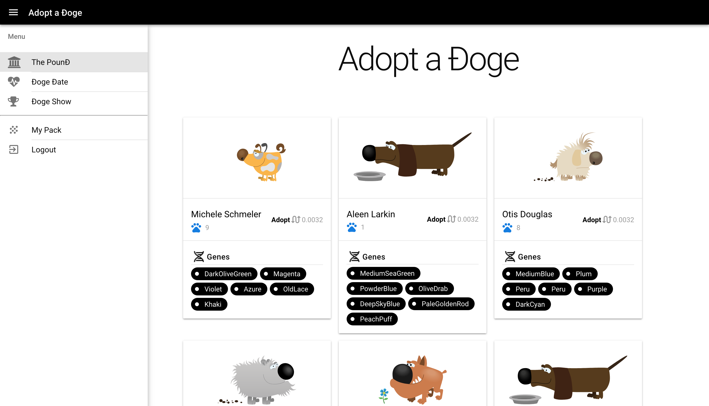

# DogeDate Frontend



## What is this?

A CryptoKitties knock off with Doges. An additional feature on top of siring will be the aspect of a DogeShow, where users compete by entering their Doge and then, utilizing Loom side chains, perform actions to gain an advantage over the other competitors to knock them out of the competition, all the while building a pool for the winner. In addition, participating in a DogeShow entitles the user to an ERC721 raffle ticket, which can also be purchased if not participating. At the end of a DogeShow, a portion of the pool will go to the raffle winner and the rest will go to the winning pup. A user will also have to, utilizing Loom side chains, perform small maintenance tasks (i.e. feed daily, play fetch, etc.) to maintain a Doge's happiness to be able to perform in a DogeShow.

## Contributing

### Backend
You'll need to set up the backend first for the frontend to function at all. Go set that up first.

[DogeDate API Repo](https://github.com/tommycox/dogedate-backend)

### Getting Started

Change directories to the frontend (which you cloned when setting up the backend):  
`cd ../dogedate-frontend`

Install dependencies:  
`npm install` or `yarn`

Then start a development server:  
`quasar dev`

This will automatically open the app in your default broswer.

Login with:
```
username: tommy.cox@protonmail.com
password: quasar
```
